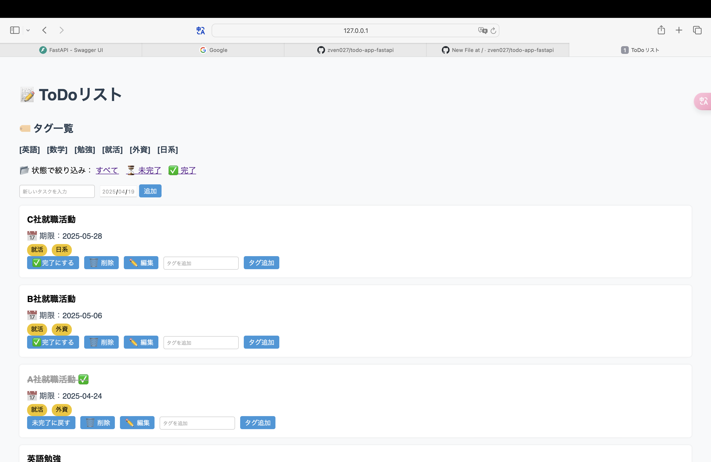
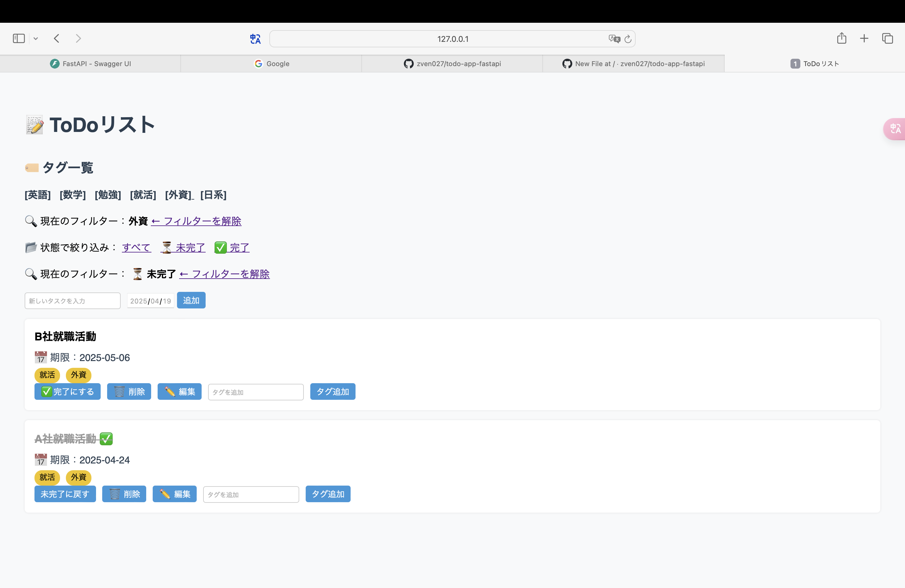
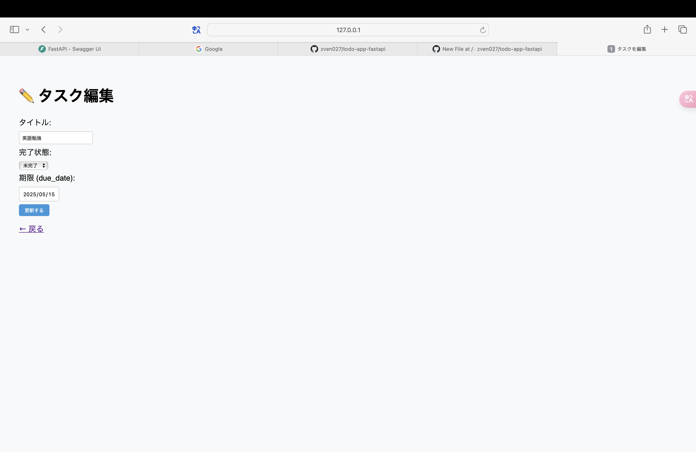

# 📝 ToDoアプリ（FastAPI + SQLModel）

FastAPI・SQLModel・Jinja2 を用いたシンプルなToDoアプリケーションです。  
タグの付与、状態の切り替え、期限（due_date）の設定など、基本的なタスク管理機能を備えています。

A simple ToDo web application built with FastAPI, SQLModel, and Jinja2.  
Includes features like tagging, completion toggling, and due date assignment.


---

## 🔗 公開デモ / Live Demo

📍 ## 🔗 公開URL（デプロイ済みアプリ）
[https://todo-app-fastapi-production.up.railway.app](https://todo-app-fastapi-production.up.railway.app)
> FastAPI + SQLModel 製のToDoアプリを Railway にてデプロイしています。

---

## 📌 使用技術 / Tech Stack

- Python 3.10+
- FastAPI
- SQLModel（SQLAlchemy + Pydantic ベース）
- Jinja2
- SQLite（ローカルDB）

---

## ✅ 主な機能 / Features

- タスクの作成・削除（UI + API 対応）
- タグ付け（多対多の関係に対応）
- タスクの完了状態の切り替え
- タグ・状態による絞り込み表示
- タスクの編集（タイトル・状態・期限）
- タスクごとの期限設定（due_date）

---

## 📸 スクリーンショット

| メイン画面 | 絞り込み機能 | 編集画面 |
|------------|--------------|----------|
|  |  |  |

---

## 🚀 セットアップ / Setup

```bash
# 依存パッケージのインストール
pip install -r requirements.txt

# 初期DBの作成（初回のみ）
python init_db.py

# 開発サーバー起動
uvicorn main:app --reload

📁 ディレクトリ構成
todo-api/
├── main.py                  # アプリエントリポイント
├── models.py                # SQLModel定義
├── crud.py                  # DB操作ロジック
├── database.py              # DB接続設定
├── init_db.py               # テーブル初期化スクリプト
├── templates/
│   ├── index.html           # メイン画面
│   └── edit.html            # タスク編集画面
├── tasks.db                 # SQLite DB（.gitignore対象）
└── README.md


---

This project is licensed under the MIT License.
✅ Railway deploy test
## Test Deploy 2025年 4月22日 火曜日 18時00分43秒 JST
## Test Deploy Tue Apr 22 18:00:49 JST 2025
